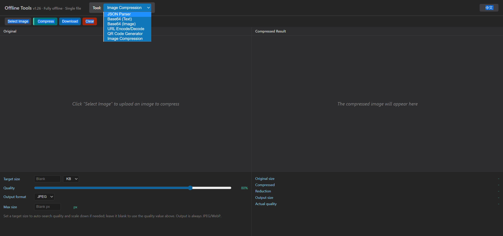

# OfflineJsonKit

A fully **offline**, single-file HTML toolbox that bundles common developer utilities: JSON parsing, Base64 encode/decode (text & image), URL encode/decode, QR code generation, and image compression.

## Preview

## Features

### 📝 JSON Parser
- Format and prettify JSON
- Minify JSON
- Clear input and copy results with one click
- Syntax-highlighted output
- Collapsible nodes
- Dark theme UI

### 🔄 Encoding Conversion
- **Base64** text encode/decode
- **URL** encode/decode
- **Image ↔ Base64** conversion
  - Upload local images and convert them to Base64
  - Paste Base64 and preview images
  - Copy Base64 results with one click

### 📱 QR Code Generator
- Generate QR codes offline from any text or link
- Works fully offline with no network requests
- Download QR codes as PNG images
- Adds a white quiet zone to improve scan reliability

### 🗜️ Image Compression
- Compress images fully offline, similar to TinyPNG / Squoosh, with no server upload
- Target-size mode: set a target size (KB/MB) and it auto-searches quality and scales down if needed to stay under the target
- Quality-slider mode: manually adjust the compression quality and see the resulting size in real time
- Output as JPEG / WebP, with an optional max width/height limit
- Shows original size, compressed size and reduction ratio, with one-click download

### 🌐 Bilingual UI
- Automatically selects Chinese or English based on browser language
- Chinese browsers default to Chinese; other browser languages default to English
- Manual language switching is persisted with `localStorage`

### 💾 Local Storage
- Uses browser `localStorage` to save the language preference
- Input auto-save is currently disabled, so refreshing the page does not restore previous input

## Usage

Open `index.html` directly in a browser. No deployment or server is required; everything runs offline.

## Changelog

See [VERSION.md](./VERSION.md) for detailed version history.

## Highlights

- ✨ Single file, no dependencies, fully offline
- 🎨 Clean and compact interface
- 🔒 Privacy-friendly: data is not uploaded to any server
- 🚀 Fast response and local processing
