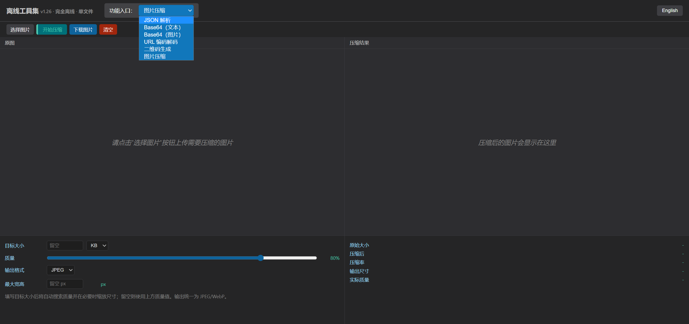

# JSON解析工具箱

[English](./README.en.md) | **简体中文**

一个**完全离线**的单HTML文件前端工具集合，集成 JSON 解析、Base64 编解码（文本/图片）、URL 编解码、二维码生成和图片压缩等常用开发工具。无需部署，无需服务器，浏览器打开即用。

## 界面预览



## 功能特性

### 📝 JSON解析
- JSON格式化/美化展示
- JSON压缩/最小化
- 语法高亮显示
- 支持节点折叠展开
- 一键清空、一键复制
- 深色主题界面

### 🔄 编码转换
- **Base64** 文本编码/解码
- **URL** 编码/解码
- **图片 ↔ Base64** 互转
  - 支持上传本地图片转换为Base64
  - 支持Base64预览图片
  - 支持一键复制结果

### 📱 二维码生成
- 输入任意文本/链接离线生成二维码
- 完全离线工作，无需网络请求
- 支持下载二维码PNG图片到本地
- 自动添加白色静区，提高扫码识别率

### 🗜️ 图片压缩
- 完全离线压缩图片，类似 TinyPNG / Squoosh，无需上传服务器
- 目标大小模式：指定目标体积（KB/MB），自动搜索质量并在必要时缩放尺寸
- 质量滑块模式：手动调节压缩质量，实时查看压缩后体积
- 支持输出 JPEG / WebP，可限制最大宽高
- 展示原始大小、压缩后大小、压缩率，并支持一键下载

### 🌐 中英文界面
- 根据浏览器语言自动选择中文或英文界面
- 中文浏览器默认显示中文，其他语言浏览器默认显示英文
- 支持手动切换语言，并使用 `localStorage` 记住用户选择

### 💾 本地存储
- 使用浏览器 `localStorage` 保存语言偏好
- 已临时禁用输入内容自动保存，刷新页面不会恢复上一次编辑内容

## 📦 项目结构

```
json_parsing/
├── index.html              # 核心应用文件（单HTML，约90KB）
├── vercel.json             # Vercel 部署配置
├── README.md               # 中文文档
├── README.en.md            # 英文文档
├── VERSION.md              # 版本更新日志（v1.0 ~ v1.26）
├── LICENSE                 # 许可证
├── README.assets/          # 中文 README 截图资源
│   └── screenshot-zh.png
└── README.en.assets/       # 英文 README 截图资源
    └── screenshot-en.png
```

## 🚀 快速开始

### 方式一：本地使用（推荐）

直接用浏览器打开 `index.html` 即可使用，无需安装任何依赖。

```bash
# 克隆项目
git clone https://github.com/user/json_parsing.git
cd json_parsing

# 直接用浏览器打开 index.html
open index.html        # macOS
start index.html       # Windows
xdg-open index.html    # Linux
```

### 方式二：Vercel 部署

项目已配置 `vercel.json`，可直接部署到 Vercel 静态站点。

```bash
# 安装 Vercel CLI
npm i -g vercel

# 部署
vercel
```

## 🛠️ 技术栈

| 层 | 技术 |
|---|---|
| 前端 | 单HTML文件，内嵌 CSS + JavaScript |
| 二维码 | 内嵌 qrcodejs 库（含里德-所罗门纠错） |
| 图片压缩 | Canvas 原生编码能力 |
| 国际化 | 自实现轻量 i18n，navigator.language + localStorage |
| 存储 | 浏览器 localStorage |
| 部署 | Vercel 静态站点 |

## 版本历史

查看 [VERSION.md](./VERSION.md) 了解详细更新记录。

当前版本：**v1.26** (2026-06-19)

## 特点

- ✨ **单文件**，零依赖，完全离线运行
- 🎨 简洁美观的深色主题界面
- 🔒 隐私安全，数据不上传任何服务器
- 🚀 快速响应，实时预览
- 🌐 中英文双语支持
- 📱 二维码完全离线生成

## 许可证

[MIT License](LICENSE)
